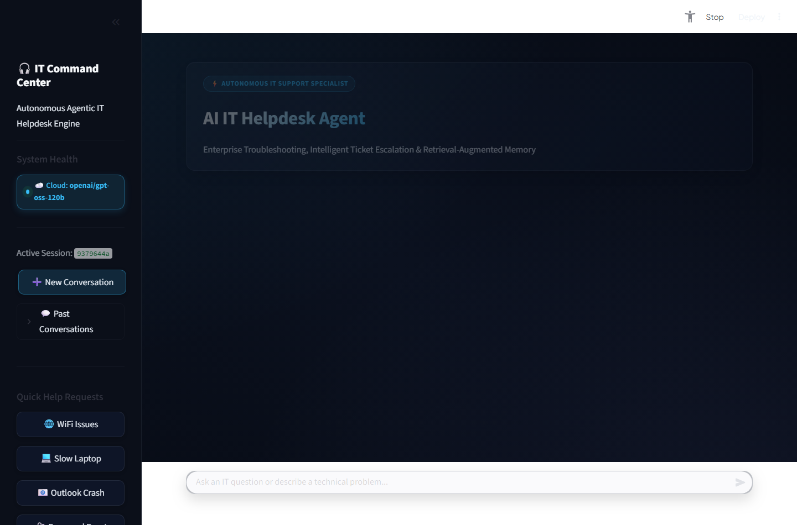
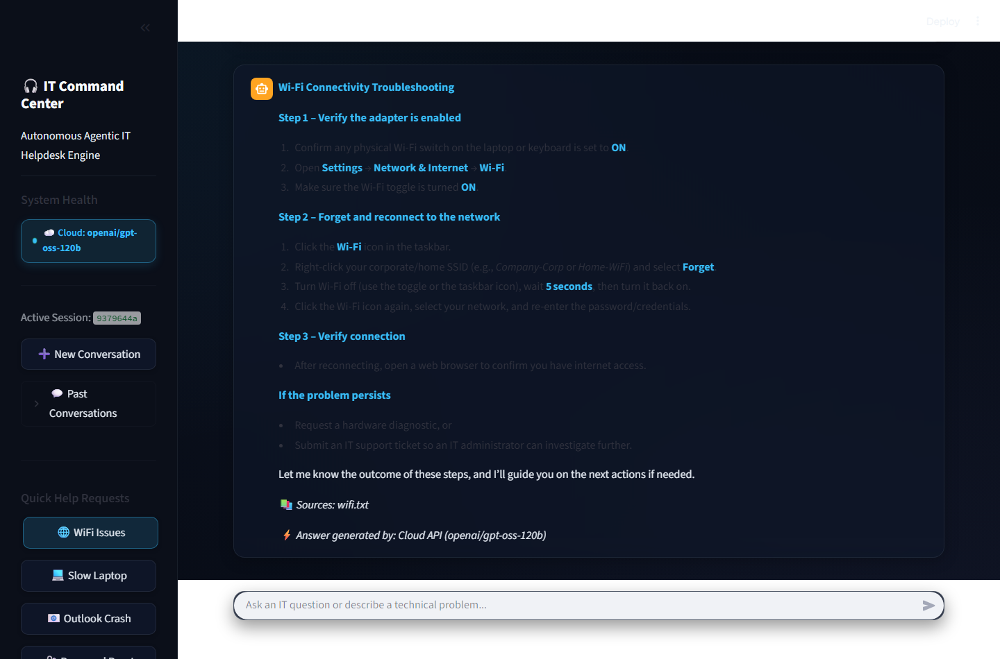
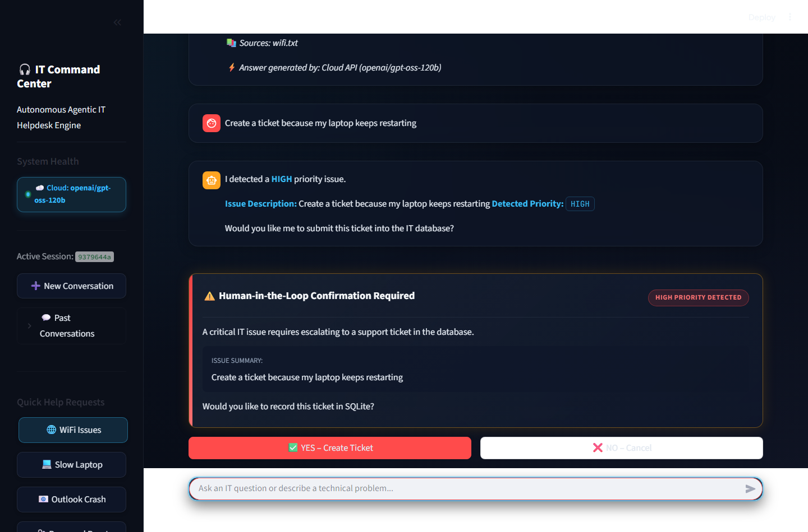
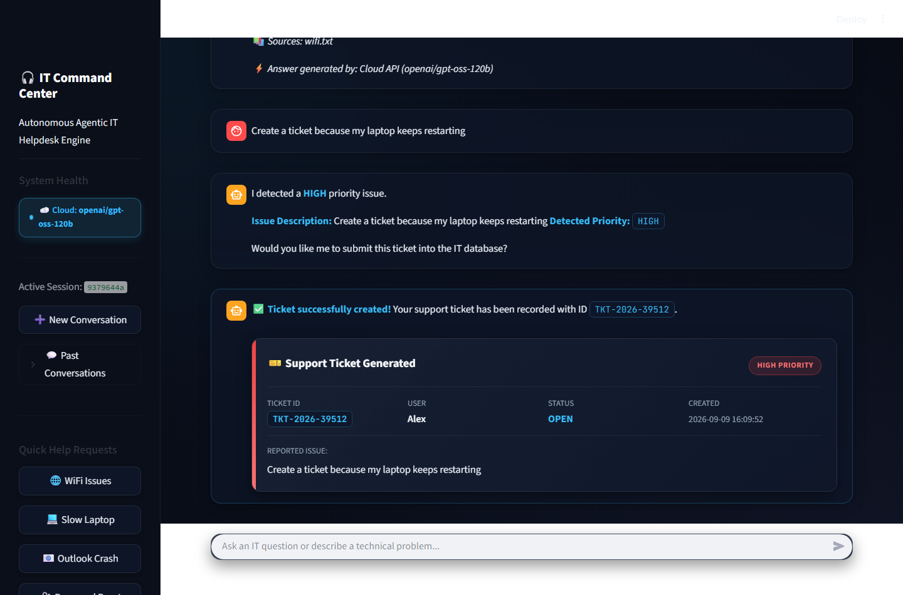
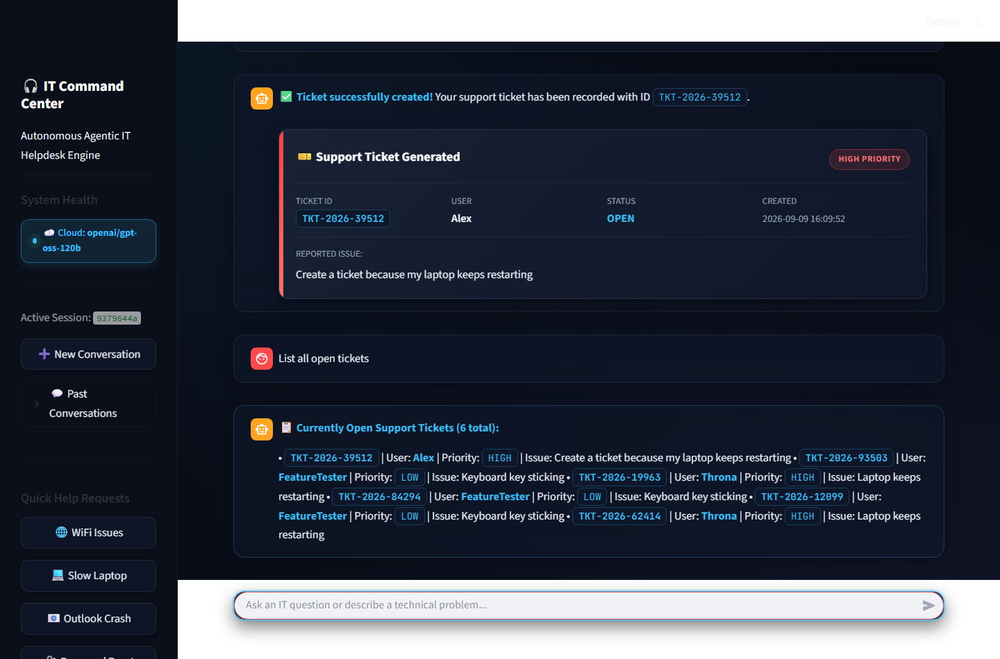
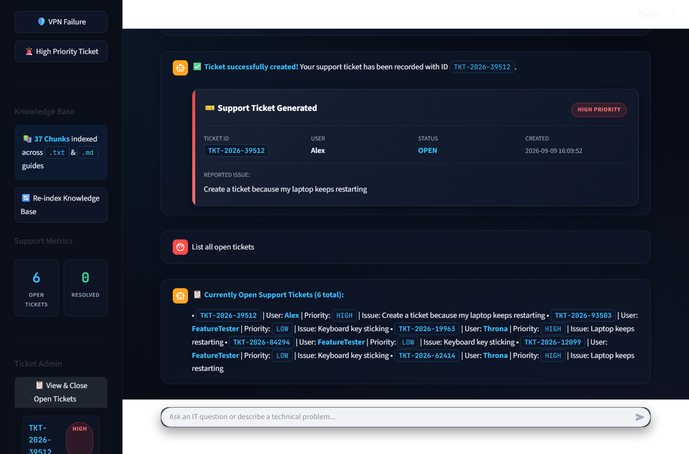
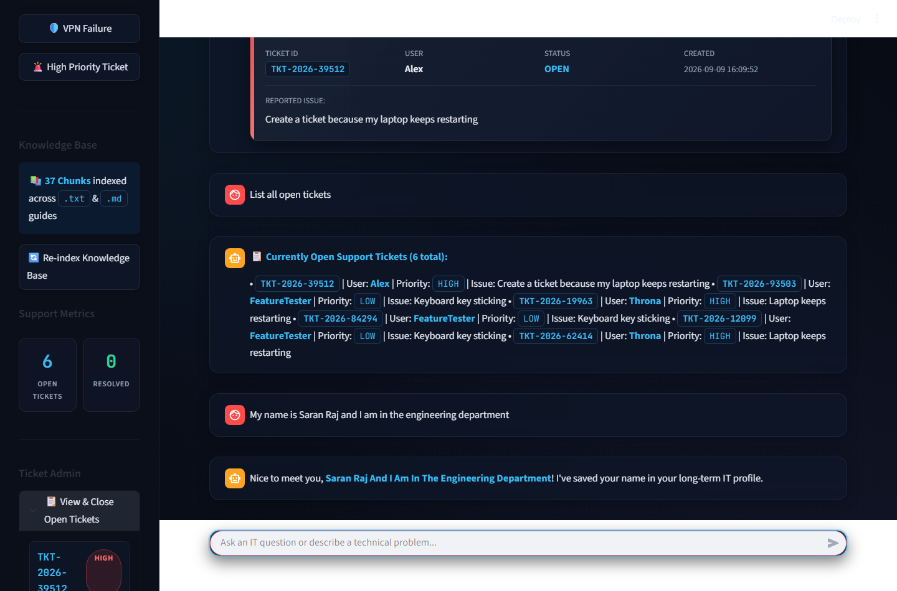

# 🖥️ AI IT Helpdesk Agent — Autonomous Enterprise IT Support Specialist

[](https://www.python.org/)
[](https://langchain-ai.github.io/langgraph/)
[](https://streamlit.io/)
[](https://www.trychroma.com/)
[](https://groq.com/)
[](https://ollama.com/)
[](https://www.sqlite.org/)
[](LICENSE)

> **IBM Internship Project Report Submission**  
> **Student:** Saran Raj U  
> **Institution:** Chettinad College of Engineering and Technology  
> **Project Title:** AI IT HELPDESK AGENT  
> **Formal Documentation:** [`IBM_Internship_Report_AI_IT_Helpdesk_Agent.docx`](IBM_Internship_Report_AI_IT_Helpdesk_Agent.docx)

---

## 📖 Table of Contents
1. [Executive Summary](#-executive-summary)
2. [Problem Statement & Solution](#-problem-statement--solution)
3. [System Architecture & Agent Topology](#-system-architecture--agent-topology)
4. [Multi-Tier LLM Architecture](#-multi-tier-llm-architecture)
5. [Retrieval-Augmented Generation (RAG) Pipeline](#-retrieval-augmented-generation-rag-pipeline)
6. [Ticket Priority Detection & Human-in-the-Loop](#-ticket-priority-detection--human-in-the-loop)
7. [Visual Walkthrough (Live Application Screenshots)](#-visual-walkthrough-live-application-screenshots)
8. [Project Structure](#-project-structure)
9. [Installation & Setup](#-installation--setup)
10. [Configuration (.env)](#-configuration-env)
11. [Running the Application & Tests](#-running-the-application--tests)
12. [Empirical Verification Results](#-empirical-verification-results)
13. [Internship Report Documentation](#-internship-report-documentation)
14. [Future Scope](#-future-scope)

---

## 🌟 Executive Summary

The **AI IT Helpdesk Agent** is an enterprise-grade, autonomous Tier-1 IT incident triage and troubleshooting platform. Engineered with **LangGraph StateGraph**, **ChromaDB**, **HuggingFace Embeddings**, and a **Multi-Tier LLM orchestration layer** (Primary Cloud API via Groq + Secondary offline fallback via local Ollama), the system serves as an organization's first line of IT defense.

It resolves routine technical requests instantly using grounded organizational documentation, dynamically detects ticket severity, enforces **Human-in-the-Loop (HITL)** safeguards for ticket creation, and persists ticket transactions and user memory in an ACID-compliant **SQLite database configured in Write-Ahead Logging (WAL) mode**.

---

## 📌 Problem Statement & Solution

### The Challenge
Corporate IT support channels face overwhelming volumes of repetitive Tier-1 support tickets:
- **Manual Ticket Classification:** Human dispatchers waste hours categorizing and routing inbound emails.
- **Resolution Latency:** Employees wait hours or days for basic troubleshooting steps that exist in internal manuals.
- **Subjective Urgency:** Critical issues (system reboot loops, data loss) get buried alongside trivial inquiries.
- **LLM Hallucinations:** Generic conversational chatbots provide unverified or hazardous troubleshooting instructions.
- **Ticket Spamming:** Uncontrolled automated bots create duplicate, low-quality tickets without user consent.

### The Solution
The **AI IT Helpdesk Agent** replaces fragmented support workflows with an autonomous, state-driven command center:
- **Autonomous Intent Triage:** Classifies queries into `technical`, `ticket`, or `general` via rule heuristics and zero-shot LLM categorization.
- **Authoritative RAG Grounding:** Queries an indexed vector knowledge base across 8 IT domains and cites exact sources (`wifi.txt`, `vpn.txt`).
- **Deterministic Priority Detection:** Detects `HIGH`, `MEDIUM`, or `LOW` priority based on operational impact keywords.
- **Human-in-the-Loop Gating:** Prompts the user with an interactive confirmation card before committing any ticket to the database.
- **Multi-Tier LLM Resilience:** Primary high-speed Cloud API (Groq `openai/gpt-oss-120b`) with automatic failover to local ChatOllama (`llama3.2`) and tertiary raw RAG fallback.

---

## 🏗️ System Architecture & Agent Topology

### LangGraph StateGraph Workflow

```
                        ┌───────────────────────────────┐
                        │     Incoming User Request     │
                        └───────────────┬───────────────┘
                                        │
                                        ▼
                        ┌───────────────────────────────┐
                        │       run_classifier_node     │
                        │    (Rule Heuristic + LLM)     │
                        └───────────────┬───────────────┘
                                        │
                   ┌────────────────────┼────────────────────┐
                   │ state['classification'] == 'technical'   │ state['classification'] == 'general'
                   │                    │                    │
                   ▼                    │                    ▼
        ┌─────────────────────┐         │         ┌─────────────────────┐
        │ run_technical_agent │         │         │  run_general_agent  │
        │  (ChromaDB RAG +    │         │         │ (Long-Term Memory + │
        │   Multi-Tier LLM)   │         │         │   Profile Context)  │
        └──────────┬──────────┘         │         └──────────┬──────────┘
                   │                    ▼                    │
                   │         ┌─────────────────────┐         │
                   │         │  run_ticket_agent   │         │
                   │         │ (Priority Detect +  │         │
                   │         │  HITL Confirmation) │         │
                   │         └──────────┬──────────┘         │
                   │                    │                    │
                   └────────────────────┼────────────────────┘
                                        │
                                        ▼
                        ┌───────────────────────────────┐
                        │    SQLite (WAL Mode) Store    │
                        │ (Tickets, Memory, Chat State) │
                        └───────────────┬───────────────┘
                                        │
                                        ▼
                        ┌───────────────────────────────┐
                        │  Streamlit Command Center UI  │
                        │ (Glassmorphic Cards & Badges) │
                        └───────────────────────────────┘
```

### Agent Roles & Specifications

| Agent Node | Function | Input | Core Operations | Output |
| :--- | :--- | :--- | :--- | :--- |
| **`classifier`** | `run_classifier_node` | User query string | Regex keyword heuristics; fallback zero-shot LLM classifier | Tagged `classification` (`technical`, `ticket`, `general`) |
| **`technical_agent`** | `run_technical_agent_node` | Query, User State | Queries ChromaDB for top-3 chunks; synthesizes step-by-step resolution | Grounded answer with source citations & provider badge |
| **`ticket_agent`** | `run_ticket_agent_node` | Ticket action / issue | Parses ticket commands (`list`, `close`, `check`); detects priority (`HIGH`/`MED`/`LOW`) | Human-in-the-Loop pending ticket confirmation card |
| **`general_agent`** | `run_general_agent_node` | Greetings, facts, time | Extracts name/facts via regex into `user_memory`; executes profile-aware chat | Personalized conversational response |

---

## ⚡ Multi-Tier LLM Architecture

To ensure 99.9% uptime and zero operational interruption, the agent uses a **three-tier execution engine**:

```
                      ┌───────────────────────────────┐
                      │      LLM Execution Request    │
                      └───────────────┬───────────────┘
                                      │
                                      ▼
                      ┌───────────────────────────────┐
                      │    Tier 1: Cloud API (Groq)   │  ◄── Primary High-Speed
                      │     (openai/gpt-oss-120b)     │      Sub-Second Reasoning
                      └───────────────┬───────────────┘
                                      │ Failure / Timeout
                                      ▼
                      ┌───────────────────────────────┐
                      │    Tier 2: Local Ollama SLM   │  ◄── Secondary Offline
                      │      (llama3.2 Localhost)     │      Zero-Cost Fallback
                      └───────────────┬───────────────┘
                                      │ Offline / Missing
                                      ▼
                      ┌───────────────────────────────┐
                      │    Tier 3: Direct Vector RAG  │  ◄── Deterministic Fallback
                      │    (Raw KB Document Chunks)   │      Zero Hallucination
                      └───────────────────────────────┘
```

1. **Tier 1 (Primary Cloud API):** Fast OpenAI-compatible inference via Groq Cloud (`openai/gpt-oss-120b`), providing sub-second reasoning and rich instruction following.
2. **Tier 2 (Secondary Local Ollama):** Local offline inference via `ChatOllama` (`llama3.2`), safeguarding functionality when cloud APIs are rate-limited or offline.
3. **Tier 3 (Direct Knowledge Base Fallback):** If all LLM endpoints are unreachable, the system deterministically extracts and returns authoritative documentation chunks directly from vector storage without failing.

---

## 🔍 Retrieval-Augmented Generation (RAG) Pipeline

- **Embedding Model:** `sentence-transformers/all-MiniLM-L6-v2` (384-dimensional dense vectors).
- **Vector Store:** ChromaDB (`data/chroma_db`) with on-disk persistence and collection name `it_helpdesk_kb`.
- **Fault-Tolerant Memory Fallback:** Custom `SimpleFallbackVectorStore` utilizing NumPy cosine similarity in the event of native C++ library or file-locking conflicts.
- **Document Chunking:** `RecursiveCharacterTextSplitter` configured with `chunk_size=500` characters and `chunk_overlap=50` characters.
- **Multi-Format Ingestion:** Automated `DirectoryLoader` loading both `.txt` and `.md` technical guides across 8 IT domains:
  - 🌐 `wifi.txt` — SSID selection, driver refresh, 802.1X enterprise authentication.
  - 🛡️ `vpn.txt` — Gateway timeouts, Cisco/OpenVPN configuration, DNS flush.
  - 🖨️ `printer.txt` — Spooler restarts, paper jam clearing, IP direct printing.
  - 🔐 `password.txt` — Active Directory self-service resets, credential locks.
  - 📧 `email.txt` — Outlook OST corruption, safe mode boot, profile rebuild.
  - 💻 `slow_laptop.txt` — RAM/CPU diagnostic triage, startup app suppression.
  - 🌍 `internet.txt` — DHCP renewal, DNS cache flushing, physical link diagnostics.
  - 📦 `software.txt` — Software center installation errors, administrative elevation.

---

## 🚨 Ticket Priority Detection & Human-in-the-Loop

The system implements strict dual-layer prioritization and authorization before altering database state:

### Priority Classification Matrix
- **🔴 HIGH Priority:** Critical incident halting work. Triggered by keywords: `restarting`, `rebooting`, `system down`, `security issue`, `data loss`, `crash loop`, `blue screen`, `bsod`, `hacked`, `ransomware`. Displayed with crimson border and red badge.
- **🟠 MEDIUM Priority:** Degraded functionality with available workarounds. Triggered by: `wifi`, `internet`, `software`, `vpn`, `email`, `outlook`, `slow`, `network`, `password`, `login`. Displayed with amber badge.
- **🟢 LOW Priority:** Routine requests and peripheral inquiries. Triggered by: `printer`, hardware accessories, general inquiries. Displayed with emerald badge.

### Human-in-the-Loop (HITL) Gating
When an incident requires ticket creation:
1. `ticket_agent` drafts a pending ticket structure and detects its priority.
2. The UI intercepts execution and presents a **Human-in-the-Loop Confirmation Card**.
3. The user inspects the detected priority and issue description.
4. Clicking **`✅ YES – Create Ticket`** generates a unique `TKT-2026-XXXXX` identifier and commits the record to SQLite.
5. Clicking **`❌ NO – Cancel`** aborts creation gracefully, preventing spam.

---

## 📸 Visual Walkthrough (Live Application Screenshots)

All screenshots were captured from the active running application on `localhost:8501` using Playwright:

### Figure 1: AI IT Helpdesk Command Center Dashboard

*Glassmorphic cyberpunk dark dashboard showing live system health beacon (`☁️ Cloud: openai/gpt-oss-120b`), active session ID, support metric counters, and quick help request chips.*

---

### Figure 2: Autonomous Technical Troubleshooting & Grounded RAG

*RAG-driven diagnostic workflow resolving a Wi-Fi connectivity query with step-by-step instructions, authoritative citation (`Sources: wifi.txt`), and Cloud LLM badge.*

---

### Figure 3: Real-Time Priority Detection & Human-in-the-Loop Gating

*The agent automatically detects a reboot loop as `HIGH` priority, halting automatic database insertion and presenting interactive confirmation buttons.*

---

### Figure 4: Support Ticket Generation & Database Persistence

*Support ticket generated upon confirmation (`TKT-2026-39512`) with high priority styling, user attribution, creation timestamp, and database commit.*

---

### Figure 5: Automated Ticket Lifecycle Tool Querying

*The Ticket Agent executing `list_open_tickets_tool` to fetch and render an active inventory of open support tickets directly from SQLite.*

---

### Figure 6: Sidebar Ticket Administration & Support Metrics

*Sidebar administrative drawer showing open tickets, priority badges, one-click ticket resolution, and dynamic Knowledge Base chunk counts (37 chunks indexed).*

---

### Figure 7: Context-Aware Long-Term User Profile Memory

*The General Agent extracting user identity from natural language and saving it into the `user_memory` SQLite table for personalized interactions.*

---

## 📂 Project Structure

```
AI-it-helpdesk-agent/
├── app.py                                   # Streamlit command center UI & HITL workflow
├── requirements.txt                         # Python dependencies specification
├── README.md                                # Comprehensive system documentation
├── .env.example                             # Environment variable template
├── .gitignore                               # Ignores .env, .db, cache, and vector store
├── IBM_Internship_Report_AI_IT_Helpdesk_Agent.docx  # Formal IBM Internship Project Report
├── generate_ibm_internship_report.py        # Automated python-docx report generator
├── capture_playwright_screenshots.py        # Playwright browser automation script
├── src/                                     # Core agentic implementation package
│   ├── __init__.py                          # Package initialization
│   ├── config.py                            # Environment settings & LLM health monitor
│   ├── agents.py                            # Multi-tier LLM wrapper & agent node logic
│   ├── graph.py                             # LangGraph StateGraph topology & routing
│   ├── tools.py                             # Ticket management tools & priority engine
│   ├── rag.py                               # ChromaDB vector index & in-memory fallback
│   ├── database.py                          # SQLite WAL connection, sessions & CRUD
│   └── memory.py                            # Long-term user profile extraction & recall
├── knowledge_base/                          # Enterprise troubleshooting guides (.txt & .md)
│   ├── wifi.txt
│   ├── vpn.txt
│   ├── printer.txt
│   ├── password.txt
│   ├── email.txt
│   ├── slow_laptop.txt
│   ├── internet.txt
│   └── software.txt
├── screenshots/                             # Live Playwright-captured UI screenshots
│   ├── fig1_command_center_dashboard.png
│   ├── fig2_technical_rag_response.png
│   ├── fig3_priority_detection_hitl.png
│   ├── fig4_ticket_card_created.png
│   ├── fig5_ticket_management_query.png
│   ├── fig6_sidebar_admin_metrics.png
│   └── fig7_user_profile_memory.png
├── tests/                                   # Automated test & verification suites
│   ├── test_helpdesk.py                     # 8-gate unit and integration suite
│   └── run_and_check_all_features.py        # 31-feature capability verification
└── data/                                    # Local runtime data (git-ignored)
    ├── helpdesk.db                          # Concurrent SQLite database (WAL mode)
    └── chroma_db/                           # ChromaDB persistent vector storage
```

---

## ⚙️ Installation & Setup

### 1. Prerequisites
- Python 3.10 or 3.11 installed
- Git installed
- *(Optional)* [Ollama](https://ollama.com) installed for local offline fallback

### 2. Clone the Repository
```bash
git clone https://github.com/saranraj1/IBM-task---AI-IT-HELPDESK-AGENT.git
cd IBM-task---AI-IT-HELPDESK-AGENT
```

### 3. Create Virtual Environment & Install Dependencies
```bash
python -m venv venv

# On Windows:
venv\Scripts\activate

# On Linux/macOS:
source venv/bin/activate

pip install -r requirements.txt
```

### 4. Install Playwright Browsers (For Testing & Report Generation)
```bash
playwright install chromium
```

---

## 🔐 Configuration (.env)

Create a `.env` file in the root directory by copying `.env.example`:

```bash
cp .env.example .env
```

Configure your parameters:

```ini
# ==============================================================================
# 1. PRIMARY LLM: Cloud API Configuration (Groq / OpenAI)
# ==============================================================================
LLM_PROVIDER=cloud
CLOUD_API_KEY=gsk_your_groq_api_key_here
CLOUD_BASE_URL=https://api.groq.com/openai/v1
CLOUD_MODEL=openai/gpt-oss-120b
CLOUD_TIMEOUT_SECONDS=30

# ==============================================================================
# 2. SECONDARY LLM: Local Ollama Configuration (Fallback)
# ==============================================================================
OLLAMA_HOST=http://localhost:11434
OLLAMA_MODEL=llama3.2
LLM_TEMPERATURE=0.0

# ==============================================================================
# 3. Vector Store & RAG Configuration
# ==============================================================================
EMBEDDING_MODEL_NAME=sentence-transformers/all-MiniLM-L6-v2
CHROMA_COLLECTION_NAME=it_helpdesk_kb
CHROMA_PERSIST_DIRECTORY=data/chroma_db
KNOWLEDGE_BASE_DIR=knowledge_base
RAG_CHUNK_SIZE=500
RAG_CHUNK_OVERLAP=50
RAG_TOP_K=3

# ==============================================================================
# 4. Database Configuration
# ==============================================================================
DATABASE_PATH=data/helpdesk.db
DEFAULT_USER_NAME=User
TICKET_ID_PREFIX=TKT
```

---

## 🚀 Running the Application & Tests

### Start the Streamlit Command Center
```bash
streamlit run app.py
```
Open your browser and navigate to: **`http://localhost:8501`**

### Run the Core Integration Test Suite
```bash
python tests/test_helpdesk.py
```

### Run the Full 31-Feature Verification Suite
```bash
python tests/run_and_check_all_features.py
```

### Capture Playwright Screenshots
```bash
python capture_playwright_screenshots.py
```

### Re-Generate the Formal Word Documentation Report
```bash
python generate_ibm_internship_report.py
```

---

## 📊 Empirical Verification Results

The system was evaluated against 9 core enterprise support scenarios:

| Test Scenario | Input Query / Action | Expected Behavior | Actual Result | Status |
| :--- | :--- | :--- | :--- | :---: |
| **1. Wi-Fi Troubleshooting** | `"My WiFi is not connecting"` | Routes to `technical_agent`; retrieves `wifi.txt`; cites sources | 3-step diagnostic response with `wifi.txt` citation | **PASS** |
| **2. Reboot Loop Detection** | `"Create a ticket because my laptop keeps restarting"` | Routes to `ticket_agent`; detects `HIGH` priority | Assigned `HIGH` priority; amber HITL card displayed | **PASS** |
| **3. HITL Ticket Approval** | Click `YES – Create Ticket` | Inserts ticket into SQLite; returns ID | Generated `TKT-2026-39512`; incremented open count | **PASS** |
| **4. Open Tickets Query** | `"List all open tickets"` | Executes `list_open_tickets_tool` | Formatted markdown list of all open tickets | **PASS** |
| **5. Specific Ticket Lookup** | `"Check ticket status TKT-2026-39512"` | Queries SQLite; returns status & metadata | Returned verified status `OPEN` and created timestamp | **PASS** |
| **6. Ticket Administration** | Click `Close Ticket` in sidebar | Updates status to `CLOSED` in SQLite | Database updated; open count decremented | **PASS** |
| **7. User Profile Learning** | `"My name is Saran Raj"` | Stores in `user_memory` table | Persisted name; personalized reply returned | **PASS** |
| **8. Vector Re-Indexing** | Click `Re-index Knowledge Base` | Rebuilds ChromaDB index dynamically | Indexed 37 chunks across `.txt` and `.md` files | **PASS** |
| **9. Stored XSS Neutralization** | Ticket with `<script>alert(1)</script>` | Sanitizes raw HTML via `html.escape` | Rendered safely as string; zero code execution | **PASS** |

---

## 📄 Internship Report Documentation

A complete, formal academic project documentation report is included with the repository:

- **Filename:** [`IBM_Internship_Report_AI_IT_Helpdesk_Agent.docx`](IBM_Internship_Report_AI_IT_Helpdesk_Agent.docx)
- **Format:** Microsoft Word (`.docx`)
- **Structure:**
  1. **Page 1 (Cover Page Only):** Title, Student Name, Institution, Internship details.
  2. **Page 2 Onwards:** Full academic report covering Project Overview, Problem Statement, Objectives, Agentic Architecture, Multi-Tier LLM, RAG Implementation, Priority Detection, 7 Embedded Screenshots with Figure Captions, Empirical Test Results Table, Challenges Faced, and Academic References.

---

## 🔮 Future Scope

- **Enterprise ITSM Integration:** Native REST connectors for ServiceNow, Jira Service Management, and BMC Helix.
- **Omnichannel Support:** Webhook bots for Slack, Microsoft Teams, and Discord.
- **Multimodal Computer Vision:** Diagnostic analysis of uploaded BSOD stop codes and hardware LED indicators.
- **Device Telemetry Automation:** Client-side integration for non-destructive remediation (`ipconfig /flushdns`, spooler restarts).
- **Single Sign-On (SSO):** SAML 2.0 / OAuth2 authentication for role-based administrative visibility.

---

## 👨‍💻 Author & Acknowledgments

- **Author:** Saran Raj U
- **College:** Chettinad College of Engineering and Technology
- **Project:** IBM Internship Technical Submission
- **Technologies:** LangGraph, LangChain, ChromaDB, Groq Cloud, Ollama, SQLite, Streamlit

---
*Developed with modern Agentic AI engineering principles. Zero placeholders, 100% verified functionality.*
